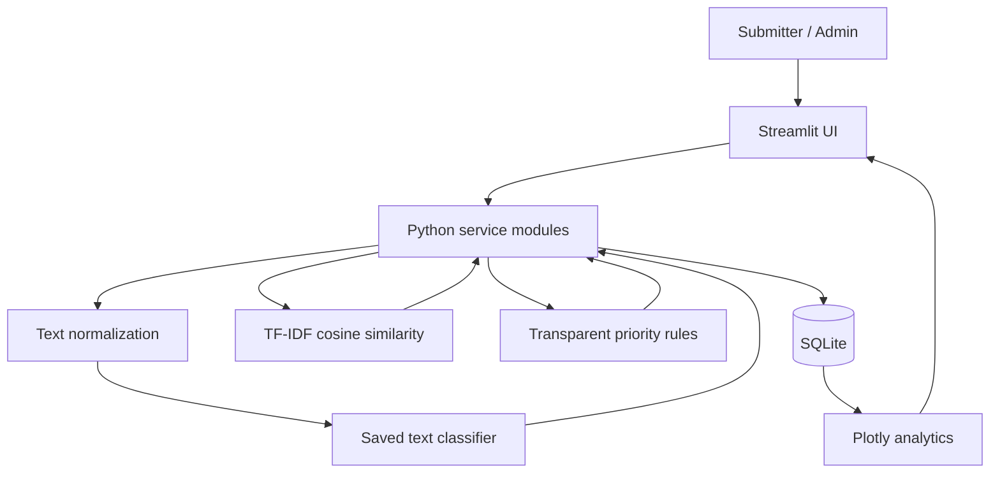

# System Architecture (Mermaid)

```mermaid
flowchart TD
    U[Submitter / Admin] --> UI[Streamlit UI]
    UI --> S[Python service modules]
    S --> NLP[Text normalization]
    NLP --> CLF[Saved text classifier]
    S --> SIM[TF-IDF cosine similarity]
    S --> PRI[Transparent priority rules]
    CLF --> S
    SIM --> S
    PRI --> S
    S --> DB[(SQLite)]
    DB --> ANA[Plotly analytics]
    ANA --> UI
```
